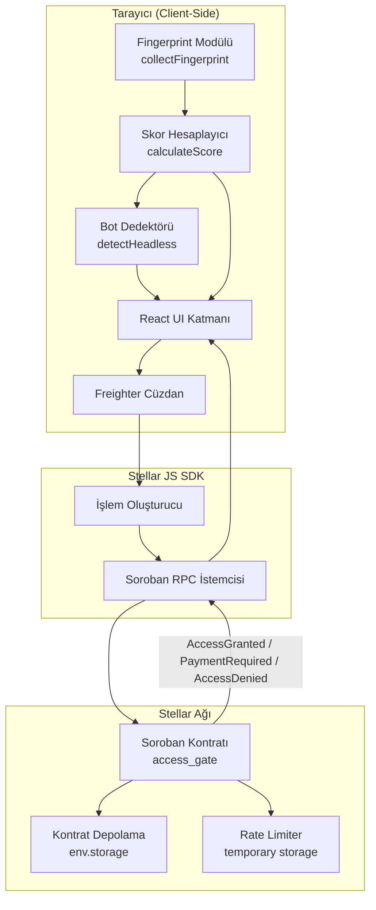
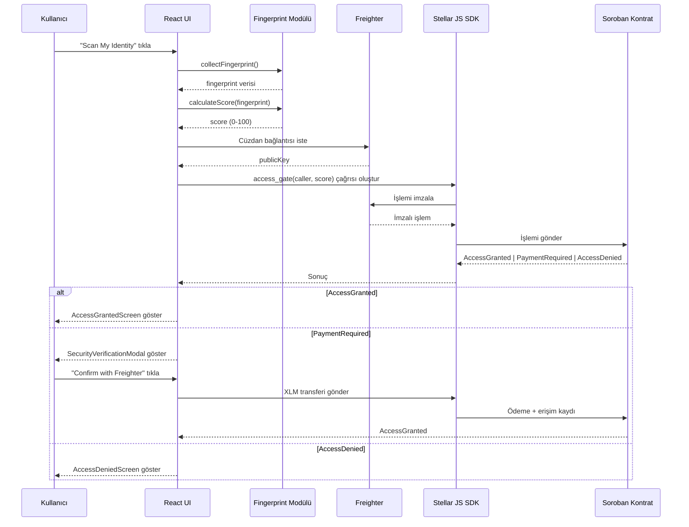
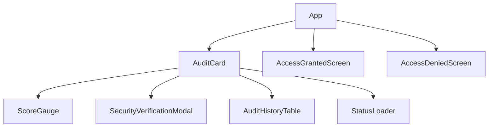

# NebulaGate — Teknik Tasarım Belgesi

## Genel Bakış

NebulaGate, Stellar Soroban blockchain üzerinde çalışan, bot hesaplarını engellemek için x402 (HTTP 402 Payment Required) protokolünü kullanan akıllı bir erişim kapısı sistemidir. Sistem üç ana katmandan oluşur:

1. **Soroban Akıllı Kontratı (Rust):** Erişim kararlarını zincir üzerinde veren, depolama ve rate limiting yöneten kontrat.
2. **Frontend Katmanı (React + Tailwind):** Tarayıcı parmak izi toplayan, AI güvenlik skoru hesaplayan ve kullanıcıya görsel geri bildirim sağlayan arayüz.
3. **Stellar JS SDK Entegrasyonu:** Freighter cüzdanı ile kontrat arasındaki köprü.

Sistem, kullanıcının tarayıcı özelliklerini analiz ederek 0–100 arasında bir güvenlik skoru üretir. Bu skor Soroban kontratına iletilir; kontrat skora göre `AccessGranted`, `PaymentRequired` veya `AccessDenied` kararı verir.

---

## Mimari

### Üst Düzey Sistem Diyagramı



### Veri Akışı



---

## Bileşenler ve Arayüzler

### Soroban Kontrat Bileşenleri

#### Enum Tanımları

```rust
/// Erişim kapısı kararları
#[contracttype]
pub enum AccessResult {
    AccessGranted,
    PaymentRequired,
    AccessDenied,
}

/// Kontrat hata türleri
#[contracterror]
#[derive(Copy, Clone, Debug, Eq, PartialEq, PartialOrd, Ord)]
pub enum ContractError {
    AuthError        = 1,  // require_auth() başarısız
    InvalidScore     = 2,  // Skor 0-100 dışında
    RateLimitExceeded = 3, // 60s içinde 10+ çağrı
    InternalError    = 4,  // Beklenmedik hata
}
```

#### Struct Tanımları

```rust
/// Başarılı erişim kaydı
#[contracttype]
pub struct AccessEntry {
    pub score: u32,
    pub timestamp: u64,
}
```

#### Kontrat Fonksiyon Arayüzleri

```rust
pub trait AccessGateTrait {
    /// Ana erişim kapısı fonksiyonu
    fn access_gate(
        env: Env,
        caller: Address,
        score: u32,
    ) -> Result<AccessResult, ContractError>;

    /// Adrese ait son erişim kaydını sorgula
    fn get_entry(
        env: Env,
        caller: Address,
    ) -> Option<AccessEntry>;
}
```

### Frontend Bileşen Hiyerarşisi



#### Bileşen Arayüzleri (TypeScript)

```typescript
// AuditCard — Ana tarama kartı
interface AuditCardProps {
  onScanComplete: (result: AccessResult) => void;
}

// ScoreGauge — SVG tabanlı skor göstergesi
interface ScoreGaugeProps {
  score: number;          // 0-100
  animated?: boolean;
}

// SecurityVerificationModal — x402 ödeme popup'ı
interface SecurityVerificationModalProps {
  isOpen: boolean;
  score: number;
  xlmAmount: number;      // varsayılan: 0.1
  onConfirm: () => void;
  onCancel: () => void;
}

// AuditHistoryTable — Geçmiş erişim tablosu
interface AuditHistoryTableProps {
  entries: AuditHistoryEntry[];
}

interface AuditHistoryEntry {
  user: string;           // kısaltılmış adres
  score: number;
  timestamp: string;
  verified: boolean;
}

// AccessGrantedScreen
interface AccessGrantedScreenProps {
  score: number;
  address: string;
}

// AccessDeniedScreen
interface AccessDeniedScreenProps {
  score: number;
  onRetry: () => void;
}
```

### Fingerprint Modülü Arayüzleri

```typescript
interface BrowserFingerprint {
  userAgent: string;
  webglRenderer: string | null;
  webglVendor: string | null;
  ipAddress: string | null;
  canvasHash: string | null;
  screenResolution: string;
  colorDepth: number;
  pixelRatio: number;
  pluginCount: number;
  plugins: string[];
  isWebdriver: boolean;
  hasWebGL: boolean;
}

// Parmak izi toplama
async function collectFingerprint(): Promise<BrowserFingerprint>

// Ağırlıklı skor hesaplama
function calculateScore(fingerprint: BrowserFingerprint): number

// Headless tarayıcı tespiti
function detectHeadless(fingerprint: BrowserFingerprint): boolean
```

### Stellar SDK Entegrasyon Arayüzü

```typescript
interface NebulaGateSDK {
  // Freighter bağlantısı
  connectWallet(): Promise<string>;  // publicKey döner

  // Kontrat çağrısı (max 3 retry)
  callAccessGate(
    caller: string,
    score: number
  ): Promise<AccessResult>;

  // Kayıt sorgulama
  getEntry(caller: string): Promise<AccessEntry | null>;

  // XLM transferi
  sendPayment(
    from: string,
    to: string,
    amount: string
  ): Promise<boolean>;
}
```

---

## Veri Modelleri

### Kontrat Depolama Şeması

```
Depolama Türü: env.storage().instance()
Anahtar: Address (Stellar public key)
Değer: AccessEntry { score: u32, timestamp: u64 }

Depolama Türü: env.storage().temporary()
Anahtar: (Address, "rate_limit")
Değer: u32 (çağrı sayacı)
TTL: 60 saniye
```

### Rate Limiting Veri Modeli

```rust
// Geçici depolama anahtarı
#[contracttype]
pub enum DataKey {
    Entry(Address),       // instance storage — kalıcı kayıt
    RateLimit(Address),   // temporary storage — 60s TTL
}
```

### Frontend Durum Modeli

```typescript
type AppState =
  | { phase: 'idle' }
  | { phase: 'scanning' }
  | { phase: 'scored'; score: number; fingerprint: BrowserFingerprint }
  | { phase: 'connecting_wallet' }
  | { phase: 'submitting'; score: number }
  | { phase: 'payment_required'; score: number }
  | { phase: 'paying' }
  | { phase: 'granted'; score: number; address: string }
  | { phase: 'denied'; score: number }
  | { phase: 'error'; message: string };
```

### Skor Ağırlık Tablosu

| Sinyal | Ağırlık | Açıklama |
|--------|---------|----------|
| User-Agent geçerliliği | +20 | Bilinen tarayıcı UA |
| WebGL varlığı | +20 | GPU renderer mevcut |
| Canvas parmak izi | +15 | Benzersiz canvas hash |
| IP itibarı | +15 | Temiz IP geçmişi |
| Plugin sayısı (>0) | +15 | En az 1 eklenti |
| Ekran çözünürlüğü | +10 | Standart çözünürlük |
| navigator.webdriver | -50 | Headless belirtisi |
| WebGL yokluğu | -30 | Headless belirtisi |
| Sıfır plugin | -20 | Headless belirtisi |

---

## Doğruluk Özellikleri

*Bir özellik, bir sistemin tüm geçerli çalışmalarında doğru olması gereken bir karakteristik veya davranıştır — temelde sistemin ne yapması gerektiğine dair biçimsel bir ifadedir. Özellikler, insan tarafından okunabilir spesifikasyonlar ile makine tarafından doğrulanabilir doğruluk garantileri arasındaki köprü görevi görür.*

### Özellik 1: Geçersiz Skor Reddi

*Herhangi bir* 0–100 aralığı dışındaki skor değeri için (negatif veya 100'den büyük), `access_gate` fonksiyonu her zaman `InvalidScore` hatası döndürmelidir.

**Doğrular: Gereksinim 1.8, 8.2**

### Özellik 2: Eşik Tutarlılığı — Erişim İzni

*Herhangi bir* geçerli adres ve 61–100 arasındaki herhangi bir skor için, `access_gate` fonksiyonu her zaman `AccessGranted` döndürmelidir.

**Doğrular: Gereksinim 1.4**

### Özellik 3: Eşik Tutarlılığı — Ödeme Gerekli

*Herhangi bir* geçerli adres ve 30–60 arasındaki herhangi bir skor için, `access_gate` fonksiyonu her zaman `PaymentRequired` döndürmelidir.

**Doğrular: Gereksinim 1.5**

### Özellik 4: Eşik Tutarlılığı — Erişim Reddi

*Herhangi bir* geçerli adres ve 0–29 arasındaki herhangi bir skor için, `access_gate` fonksiyonu her zaman `AccessDenied` döndürmelidir.

**Doğrular: Gereksinim 1.6**

### Özellik 5: Depolama Round-Trip

*Herhangi bir* geçerli adres ve >60 skor için, `access_gate` çağrısı sonrasında `get_entry` aynı adres için bir kayıt döndürmelidir; döndürülen kayıttaki skor, çağrıda kullanılan skorla eşleşmelidir.

**Doğrular: Gereksinim 1.7, 2.1, 2.3**

### Özellik 6: Kayıt Güncelleme Tutarlılığı

*Herhangi bir* geçerli adres için, aynı adresle birden fazla başarılı `access_gate` çağrısı yapıldığında, `get_entry` her zaman en son çağrıdaki skoru döndürmelidir.

**Doğrular: Gereksinim 2.2**

### Özellik 7: Kayıtsız Adres None Döndürür

*Herhangi bir* daha önce `access_gate` çağrısı yapmamış adres için, `get_entry` her zaman `None` döndürmelidir.

**Doğrular: Gereksinim 2.4**

### Özellik 8: Rate Limiting

*Herhangi bir* geçerli adres için, 60 saniye içinde 10'dan fazla `access_gate` çağrısı yapıldığında, 11. ve sonraki çağrılar her zaman `RateLimitExceeded` hatası döndürmelidir.

**Doğrular: Gereksinim 8.4**

### Özellik 9: Skor Aralığı Geçerliliği

*Herhangi bir* tarayıcı parmak izi verisi için, `calculateScore` fonksiyonu her zaman 0–100 (dahil) arasında bir tam sayı döndürmelidir.

**Doğrular: Gereksinim 3.7**

### Özellik 10: Headless Tespiti Skoru Düşürür

*Herhangi bir* headless tarayıcı belirtisi içeren parmak izi için (navigator.webdriver=true, WebGL yok veya plugin sayısı=0), `calculateScore` fonksiyonu her zaman 30'un altında bir skor döndürmelidir.

**Doğrular: Gereksinim 3.9**

### Özellik 11: İmzasız Çağrı Reddi

*Herhangi bir* adres ve geçerli skor için, `require_auth()` doğrulaması başarısız olduğunda `access_gate` her zaman `AuthError` döndürmelidir.

**Doğrular: Gereksinim 1.2, 1.3, 8.1**

---

## Hata Yönetimi

### Kontrat Hata Hiyerarşisi

```
ContractError
├── AuthError (1)         → require_auth() başarısız
├── InvalidScore (2)      → score < 0 veya score > 100
├── RateLimitExceeded (3) → 60s içinde 10+ çağrı
└── InternalError (4)     → Beklenmedik durum
```

### Frontend Hata Yönetimi

```typescript
// Retry mantığı — max 3 deneme, exponential backoff
async function callWithRetry<T>(
  fn: () => Promise<T>,
  maxRetries = 3,
  baseDelay = 1000
): Promise<T> {
  for (let attempt = 0; attempt < maxRetries; attempt++) {
    try {
      return await fn();
    } catch (err) {
      if (attempt === maxRetries - 1) throw err;
      await delay(baseDelay * Math.pow(2, attempt));
    }
  }
  throw new Error('Max retries exceeded');
}
```

### Hata Durumu Eşlemeleri

| Hata | Kullanıcıya Gösterilen Mesaj | Aksiyon |
|------|------------------------------|---------|
| `AuthError` | "Cüzdan imzası doğrulanamadı" | Yeniden bağlan |
| `InvalidScore` | "Güvenlik skoru hesaplanamadı" | Yeniden tara |
| `RateLimitExceeded` | "Çok fazla deneme. 60 saniye bekleyin." | Geri sayım göster |
| `InternalError` | "Sistem hatası oluştu" | Destek bağlantısı |
| `NetworkError` | "Ağ bağlantısı kesildi" | 3 retry sonrası göster |
| Freighter yok | "Freighter cüzdanı yüklü değil" | Kurulum linki |

---

## Test Stratejisi

### Genel Yaklaşım

NebulaGate iki tamamlayıcı test katmanı kullanır:

- **Birim testler:** Belirli örnekler, sınır koşulları ve hata durumları
- **Özellik tabanlı testler (PBT):** Tüm girdiler üzerinde evrensel özellikleri doğrulayan testler

### Soroban Kontrat Testleri (Rust)

**PBT Kütüphanesi:** `proptest` (Rust)

Her özellik testi minimum 100 iterasyon çalıştırmalıdır.

```rust
// Özellik 1: Geçersiz skor reddi
// Feature: nebula-gate, Property 1: Geçersiz skor her zaman InvalidScore döndürür
proptest! {
    #[test]
    fn prop_invalid_score_rejected(score in (101u32..=u32::MAX)) {
        // score > 100 için InvalidScore beklenir
    }
}

// Özellik 2-4: Eşik tutarlılığı
// Feature: nebula-gate, Property 2-4: Eşik kararları tutarlı
proptest! {
    #[test]
    fn prop_threshold_consistency(score in 0u32..=100u32) {
        // score > 60 → AccessGranted
        // 30 <= score <= 60 → PaymentRequired
        // score < 30 → AccessDenied
    }
}

// Özellik 5: Depolama round-trip
// Feature: nebula-gate, Property 5: AccessGranted sonrası kayıt mevcut
proptest! {
    #[test]
    fn prop_storage_round_trip(score in 61u32..=100u32) {
        // access_gate → get_entry → skor eşleşmeli
    }
}

// Özellik 8: Rate limiting
// Feature: nebula-gate, Property 8: 10+ çağrı RateLimitExceeded döndürür
proptest! {
    #[test]
    fn prop_rate_limit_enforced() {
        // 11. çağrı RateLimitExceeded döndürmeli
    }
}
```

### Frontend Testleri (TypeScript)

**PBT Kütüphanesi:** `fast-check`

```typescript
// Özellik 9: Skor aralığı geçerliliği
// Feature: nebula-gate, Property 9: calculateScore her zaman 0-100 döndürür
test('prop_score_range_valid', () => {
  fc.assert(fc.property(
    fc.record({ /* fingerprint alanları */ }),
    (fingerprint) => {
      const score = calculateScore(fingerprint);
      return score >= 0 && score <= 100;
    }
  ), { numRuns: 100 });
});

// Özellik 10: Headless tespiti
// Feature: nebula-gate, Property 10: Headless parmak izi skoru <30
test('prop_headless_score_below_threshold', () => {
  fc.assert(fc.property(
    fc.record({ isWebdriver: fc.constant(true), hasWebGL: fc.constant(false), pluginCount: fc.constant(0) }),
    (headlessFingerprint) => {
      return calculateScore(headlessFingerprint) < 30;
    }
  ), { numRuns: 100 });
});
```

### Birim Testler

- Her `ContractError` varyantı için örnek tabanlı testler
- Freighter bağlantı/bağlantı kesme senaryoları
- x402 ödeme akışı (mock Stellar ağı)
- UI bileşen snapshot testleri (Vitest + React Testing Library)
- Responsive tasarım testleri

### Entegrasyon Testleri

- Soroban testnet üzerinde uçtan uca akış
- Freighter ile gerçek imzalama akışı
- XLM transferi doğrulaması

---

## Renk Paleti ve Tasarım Sistemi

### Renk Değerleri

```typescript
const colors = {
  // Arka planlar
  background: {
    primary: '#0d1117',    // midnight navy
    secondary: '#1c2128',  // charcoal grey
    card: 'rgba(28, 33, 40, 0.8)', // glassmorphism
  },
  // Vurgu renkleri
  accent: {
    sapphire: '#2563eb',   // birincil — butonlar, başarı
    amber: '#f59e0b',      // ikincil — uyarı, 402
  },
  // Tipografi
  text: {
    primary: '#ffffff',
    secondary: '#e5e7eb',
    muted: '#9ca3af',
  },
  // Durum renkleri
  status: {
    success: '#2563eb',    // safir (neon yeşil değil)
    warning: '#f59e0b',    // kehribar
    error: '#dc2626',      // kırmızı (yalnızca hata için)
  },
};
```

### Tailwind Konfigürasyonu

```javascript
// tailwind.config.js
module.exports = {
  theme: {
    extend: {
      colors: {
        'midnight': '#0d1117',
        'charcoal': '#1c2128',
        'sapphire': '#2563eb',
        'amber-gate': '#f59e0b',
      },
      backdropBlur: {
        xs: '2px',
      },
    },
  },
};
```

### Glassmorphism Kart Stili

```css
.audit-card {
  background: rgba(28, 33, 40, 0.8);
  backdrop-filter: blur(12px);
  border: 1px solid rgba(37, 99, 235, 0.2);
  border-radius: 1rem; /* rounded-2xl */
  box-shadow: 0 8px 32px rgba(0, 0, 0, 0.4);
}
```

### ScoreGauge SVG Gradient

```typescript
// Safir mavisi → Kehribar gradient
// score >= 70: safir (#2563eb)
// 30 <= score < 70: kehribar (#f59e0b)
// score < 30: kırmızı (#dc2626)
const gaugeColor = score >= 70
  ? '#2563eb'
  : score >= 30
  ? '#f59e0b'
  : '#dc2626';
```


---

## Soroban Kontrat Detaylı Tasarımı

### Kontrat Yapısı (Rust)

```rust
use soroban_sdk::{
    contract, contractimpl, contracttype, contracterror,
    Address, Env, Symbol,
};

#[contract]
pub struct AccessGateContract;

#[contracttype]
pub enum AccessResult {
    AccessGranted,
    PaymentRequired,
    AccessDenied,
}

#[contracterror]
#[derive(Copy, Clone, Debug, Eq, PartialEq, PartialOrd, Ord)]
pub enum ContractError {
    AuthError         = 1,
    InvalidScore      = 2,
    RateLimitExceeded = 3,
    InternalError     = 4,
}

#[contracttype]
pub struct AccessEntry {
    pub score: u32,
    pub timestamp: u64,
}

#[contracttype]
pub enum DataKey {
    Entry(Address),
    RateLimit(Address),
}

const RATE_LIMIT_MAX: u32 = 10;
const RATE_LIMIT_TTL: u32 = 60; // saniye (ledger TTL olarak)

#[contractimpl]
impl AccessGateContract {
    pub fn access_gate(
        env: Env,
        caller: Address,
        score: u32,
    ) -> Result<AccessResult, ContractError> {
        // 1. İmza doğrulama
        caller.require_auth();

        // 2. Skor aralığı doğrulama
        if score > 100 {
            return Err(ContractError::InvalidScore);
        }

        // 3. Rate limiting kontrolü
        let rate_key = DataKey::RateLimit(caller.clone());
        let call_count: u32 = env
            .storage()
            .temporary()
            .get(&rate_key)
            .unwrap_or(0);

        if call_count >= RATE_LIMIT_MAX {
            return Err(ContractError::RateLimitExceeded);
        }

        // Sayacı artır, TTL ayarla
        env.storage()
            .temporary()
            .set(&rate_key, &(call_count + 1));
        env.storage()
            .temporary()
            .extend_ttl(&rate_key, RATE_LIMIT_TTL, RATE_LIMIT_TTL);

        // 4. Eşik kararı
        let result = if score > 60 {
            // Başarılı erişim — kaydet
            let entry = AccessEntry {
                score,
                timestamp: env.ledger().timestamp(),
            };
            let entry_key = DataKey::Entry(caller.clone());
            env.storage().instance().set(&entry_key, &entry);
            AccessResult::AccessGranted
        } else if score >= 30 {
            AccessResult::PaymentRequired
        } else {
            AccessResult::AccessDenied
        };

        Ok(result)
    }

    pub fn get_entry(
        env: Env,
        caller: Address,
    ) -> Option<AccessEntry> {
        let key = DataKey::Entry(caller);
        env.storage().instance().get(&key)
    }
}
```

### Depolama Stratejisi

| Depolama Türü | Kullanım | TTL |
|---------------|----------|-----|
| `instance()` | Başarılı erişim kayıtları (`AccessEntry`) | Kalıcı |
| `temporary()` | Rate limit sayaçları | 60 saniye |

---

## Stellar JS SDK Entegrasyon Detayları

### Freighter Bağlantı Akışı

```typescript
import {
  isConnected,
  getPublicKey,
  signTransaction,
} from '@stellar/freighter-api';
import {
  Contract,
  Networks,
  TransactionBuilder,
  BASE_FEE,
  SorobanRpc,
} from '@stellar/stellar-sdk';

const SOROBAN_RPC_URL = 'https://soroban-testnet.stellar.org';
const CONTRACT_ID = 'C...'; // deploy edilen kontrat ID'si
const NETWORK_PASSPHRASE = Networks.TESTNET;

// Freighter bağlantısı
async function connectWallet(): Promise<string> {
  const connected = await isConnected();
  if (!connected) {
    throw new Error('FREIGHTER_NOT_INSTALLED');
  }
  return await getPublicKey();
}

// access_gate kontrat çağrısı
async function callAccessGate(
  callerPublicKey: string,
  score: number
): Promise<AccessResult> {
  const server = new SorobanRpc.Server(SOROBAN_RPC_URL);
  const contract = new Contract(CONTRACT_ID);
  const account = await server.getAccount(callerPublicKey);

  const tx = new TransactionBuilder(account, {
    fee: BASE_FEE,
    networkPassphrase: NETWORK_PASSPHRASE,
  })
    .addOperation(
      contract.call(
        'access_gate',
        // caller ve score parametreleri
      )
    )
    .setTimeout(30)
    .build();

  // Soroban simülasyonu
  const simResult = await server.simulateTransaction(tx);
  const preparedTx = SorobanRpc.assembleTransaction(tx, simResult);

  // Freighter ile imzala
  const signedXdr = await signTransaction(
    preparedTx.toXDR(),
    { networkPassphrase: NETWORK_PASSPHRASE }
  );

  // Gönder ve sonucu bekle
  const response = await server.sendTransaction(
    TransactionBuilder.fromXDR(signedXdr, NETWORK_PASSPHRASE)
  );

  return parseAccessResult(response);
}
```

### Retry Mantığı

```typescript
async function callAccessGateWithRetry(
  caller: string,
  score: number,
  maxRetries = 3
): Promise<AccessResult> {
  return callWithRetry(
    () => callAccessGate(caller, score),
    maxRetries,
    1000
  );
}
```

---

## Browser Fingerprinting Modülü Detayları

### collectFingerprint() Implementasyonu

```typescript
async function collectFingerprint(): Promise<BrowserFingerprint> {
  // WebGL bilgileri
  const canvas = document.createElement('canvas');
  const gl = canvas.getContext('webgl') as WebGLRenderingContext | null;
  const debugInfo = gl?.getExtension('WEBGL_debug_renderer_info');

  // Canvas parmak izi
  const ctx = canvas.getContext('2d');
  ctx?.fillText('NebulaGate fingerprint', 10, 50);
  const canvasHash = canvas.toDataURL();

  // IP adresi (harici servis)
  let ipAddress: string | null = null;
  try {
    const res = await fetch('https://api.ipify.org?format=json');
    const data = await res.json();
    ipAddress = data.ip;
  } catch {
    ipAddress = null;
  }

  return {
    userAgent: navigator.userAgent,
    webglRenderer: gl && debugInfo
      ? gl.getParameter(debugInfo.UNMASKED_RENDERER_WEBGL)
      : null,
    webglVendor: gl && debugInfo
      ? gl.getParameter(debugInfo.UNMASKED_VENDOR_WEBGL)
      : null,
    ipAddress,
    canvasHash,
    screenResolution: `${screen.width}x${screen.height}`,
    colorDepth: screen.colorDepth,
    pixelRatio: window.devicePixelRatio,
    pluginCount: navigator.plugins.length,
    plugins: Array.from(navigator.plugins).map(p => p.name),
    isWebdriver: !!(navigator as any).webdriver,
    hasWebGL: gl !== null,
  };
}
```

### calculateScore() Ağırlıklı Hesaplama

```typescript
function calculateScore(fp: BrowserFingerprint): number {
  let score = 0;

  // Pozitif sinyaller
  if (fp.userAgent && fp.userAgent.length > 0) score += 20;
  if (fp.hasWebGL && fp.webglRenderer) score += 20;
  if (fp.canvasHash && fp.canvasHash.length > 100) score += 15;
  if (fp.ipAddress) score += 15;
  if (fp.pluginCount > 0) score += 15;
  if (fp.screenResolution !== '0x0') score += 10;
  if (fp.colorDepth >= 24) score += 5;

  // Negatif sinyaller (headless belirtileri)
  if (fp.isWebdriver) score -= 50;
  if (!fp.hasWebGL) score -= 30;
  if (fp.pluginCount === 0) score -= 20;

  // 0-100 aralığına sıkıştır
  return Math.max(0, Math.min(100, score));
}
```

### detectHeadless() Fonksiyonu

```typescript
function detectHeadless(fp: BrowserFingerprint): boolean {
  return (
    fp.isWebdriver === true ||
    fp.hasWebGL === false ||
    fp.pluginCount === 0
  );
}
```
